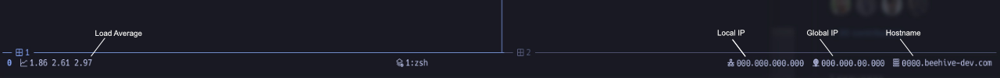

# Plain theme for [tmux](https://github.com/tmux/tmux/wiki)

シンプルな [tmux](https://github.com/tmux/tmux/wiki) のテーマです。

## TPM を使ったインストール

[tpm](https://github.com/tmux-plugins/tpm) を使用できるようにした状態で、`tmux.conf` に次のように記述してください。

```
set -g @plugin 'mackie376/tmux-plain'
```

また、実行するスクリプトには `zsh` を使っているので、使用する前にインストールしておく必要があります。

## 設定

Plain テーマは、プラグインとしての拡張性を持たせつつも、必要最小限の情報のみを表示するように実装しています。

デフォルト値は以下のようになっています。`tmux.conf` で記述することで表示内容を変更できます。

```
set-option -g @plain_show_icon true
set-option -g @plain_military_time true
set-option -g @plain_left_status 'session loadavg'
set-option -g @plain_right_status 'lan_ip wan_ip hostname'
```

現在のところ、`@plain_left_status` / `@plain_right_status` に設定できる値は、

- session
- loadavg
- lan_ip
- wan_ip
- hostname

のみとなっています。

## Screenshot

以下のスクリーンショットのターミナルのフォントには、[白源フォント](https://github.com/yuru7/HackGen) を使用しています。


